# MS-ADOD Test Suite Design Specification

* [Technical Document Analysis](#_Toc427329419)
    * [Introduction](#_Toc427329420)
		* [Overview](#_Toc427329421)
    * [Protocol Relationships](#_Toc427329422)
    * [Test Approach Summary](#_Toc427329423)
* [Test Suite Planning](#_Toc427329424)
    * [Assumptions, Scope and Constraints](#_Toc427329425)
		* [Assumptions](#_Toc427329426)
		* [Scope](#_Toc427329427)
		* [Constraints](#_Toc427329428)
    * [Test Approach Detail](#_Toc427329429)
		* [Test Method](#_Toc427329430)
		* [Test Suite Architecture](#_Toc427329431)
    * [Technical Feasibility of Message Generation/Adapter Approach](#_Toc427329432)
    * [Considerations](#_Toc427329433)
    * [Test Scenarios](#_Toc427329434)
		* [Test Scenarios](#_Toc427329435)
		* [Test Case Families](#_Toc427329436)
* [Test Suite Design](#_Toc427329437)
    * [Test Design Description](#_Toc427329438)
    * [Test Cases Design](#_Toc427329439)
    * [Adaptors](#_Toc427329440)
* [Appendix](#_Toc427329441)
    * [Glossary (Optional)](#_Toc427329442)
    * [Reference](#_Toc427329443)

## <a name="_Toc427329419"/>Technical Document Analysis

### <a name="_Toc427329420"/>Introduction

#### <a name="_Toc427329421"/>Overview
The goal of the MS-ADOD overview document is to present a high-level view of the interactions among Active Directory protocols, and to describe the intended client-to-server and server-to-server functionality of Active Directory, such as object management, identity lifecycle management, schema management, name translation, directory replication, trust management, and domain services. The Active Directory protocols provide a centralized directory service with the ability to integrate into the Microsoft Windows domain security model. 

Our test suite covers the following scenarios:

* Domain-Join:

	* Locate a domain controller
	* Join a domain
	* Unjoin a domain

* Directory:

	* Provision a user account using the LDAP protocol
	* Provision a user account using the SAMR protocol
	* Change a user account password using LDAP Protocol
	* Change a user account password using SAMR Protocol
	* Determine a user account’s group membership using the LDAP protocol
	* Delete a user account
	* Obtain a list of user accounts using the LDAP protocol
	* Manage groups and their memberships
	* Delete a group

In addition to the client and server status check, the test suite also validates protocol selection (LDAP or SAMR). 

MS-ADOD provides multiple locate domain controller and join the domain scenarions, which are covered by this test suite:   

* Locate a domain controller using DNS

* Locate a domain controller using NetBIOS

* Join a domain using a predefined account

* Join a domain by creating an account via SAMR

* Join a domain by creating an account via LDAP

The environment for the MS-ADOD test suite should be configured as shown in the following diagram:

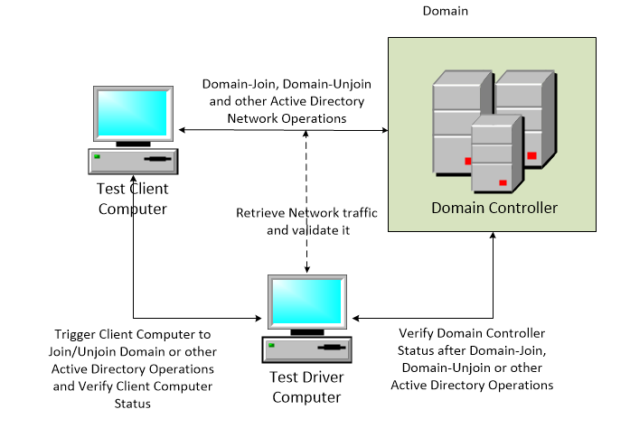
 ***Figure 11: Test Environment***

When the test suite runs, the test cases are initialized by the test driver computer. After initialization, the test driver computer starts Network Monitor and triggers the test client computer to perform specific test case actions. The Test Driver will then attempt to access both the Domain Controller/Server and the test client computer/Client by remote access to verify status. 

Upon the successful verification of status, the test driver computer stops Network Monitor and verifies messages. Finally, the test driver computer cleans up the environment and prepares for the next run. Note that whenever an error occurs that causes a test case to fail, the test driver computer will immediately stop the test case, clean up the environment, and prepare for the next run. Manual cleanup is required only after unexpected errors, such as power failures or system crashes. 

To illustrate test suite operation, here is an example using the “join the domain via a predefined account” test case:

* The test driver computer contacts the Domain Controller and creates a Computer Account in Active Directory. 

* The test driver computer accesses the Client Computer and triggers it to join the domain using the Computer Account that has just been created. Network Monitor captures the messages going over the wire. 

* After the Client Computer successfully joins the domain, the Driver Computer accesses the Domain Controller and verifies that the computer account is enabled. 

* The test driver computer remotes to the Client Computer and verifies local variables to confirm that it joined the domain. 

* The Test Driver stops the network capture and verifies messages. 

* The test driver computer cleans up the test environment.

The test environment was designed using Windows 8 for both the Client Computer and the Domain Controller.  However, Windows 8 is not a requirement, and you could replace either of them with your own environment based on another operating systems.

### <a name="_Toc427329422"/>Protocol Relationships 
Active Directory is based on the several protocols, which can be divided into five functional groups:

The core group: LDAP and DSSP
The SAM group: SAMR and SAMS
The LSA group: LSAD and LSAT
The Web Services group: WS-Transfer, WS-Enumeration, and ADCAP
The Directory Replication group: DRSR and SRPL

Each group accomplishes an interrelated set of tasks, and protocols in the same group are typically used by a client in conjunction with other protocols in the same group.

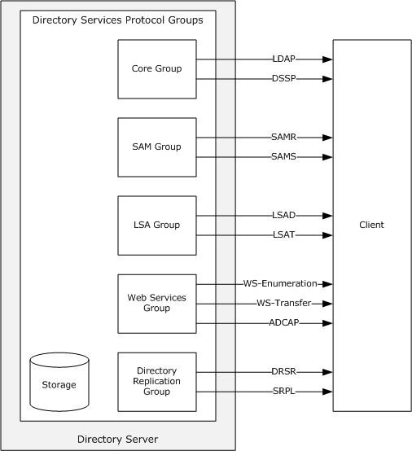

Figure 1-2:  Active Directory Protocol grouping

For more information, please refer to MS-ADOD technical document, section 2.3.

### <a name="_Toc427329423"/>Test Approach Summary
A six-phase test approach is used for validating AD related scenarios. This test approach consists of the following phases:

* **Initialize the Test Case** – Initialize both the client and domain controller (DC). Verification and possible actions include stopping Network Monitor on the driver computer, unjoining the client from domain, and cleaning up test user accounts, group accounts, and computer accounts in Active Directory.

* **Prepare the Test Case** – Make preparations for the test case. For example, if we want to test joining the domain using a predefined account, we have to create a computer account in Active Directory first.

* **Trigger Scenarios and Message Generation** – Based on scenarios in MS-ADOD, use managed UI procedures, PowerShell scripts, or some other kinds of scripts to trigger the scenarios. Capture all of the messages on the wire between the client and DC.

* **Verify States** – After the triggering a scenario, verify the client and DC’s states. For example, after triggering “Join a domain by creating an account via LDAP,” the test suite will remotely access the client to verify success. The test suite will also access the DC to check if the client’s computer account has been successfully created in Active Directory and if the state is enabled.

* **Message Validation** – Requirements are validated using Network Monitor capture files obtained during the Message Generation phase. Validation compares the sequence and contents of expected messages against the generated messages. 

* **Clean Up the Test Case** – After each test case run, regardless of state (pass or fail), the test suite cleans up so as not to affect the next test case run. The actions include stopping Network Monitor on driver computer, unjoining client from domain, and cleaning up test user accounts, group accounts, and computer accounts in Active Directory.

This test approach is explained in a complete detail in [Section 2.2](#_Test_Suite_Approach) of this document. 

## <a name="_Toc427329424"/>Test Suite Planning

### <a name="_Toc427329425"/>Assumptions, Scope and Constraints

#### <a name="_Toc427329426"/>Assumptions
The following assumptions and preconditions must be satisfied for the test suite to start operation successfully:

* For Active Directory Domain Services (AD DS), the server must be configured (that is, "promoted") to act as an AD DS domain controller. This is accomplished by having the server host the Active Directory service in AD DS mode. When hosting an AD DS directory service, the directory server should register (if not already registered) DNS and NetBIOS records, as described in [[MS-ADTS]](file:///C:/Users/dilarsen/AppData/Roaming/Microsoft/Word/[MS-ADTS].pdf) sections 6.3.2 and 6.3.4, respectively, to enable clients to locate the directory server. If an AD LDS directory service is hosted on a directory server that is joined to an AD DS domain, the directory server should publish itself by creating an object in AD DS, as described in [MS-ADTS] section 6.3.8.
* When operating as an AD DS, after the server has initialized the protocols listed in section 1.2 and is prepared to process incoming requests for those protocols, the directory server should begin responding to LDAP and mailslot ping requests in the manner described in [MS-ADTS] sections 6.3.3 and 6.3.5, respectively.
* For AD DS, member clients assume basic network connectivity and the availability of basic network infrastructure services such as DNS. Prior to being associated with a domain, there are no other preconditions of note for member clients. Once a client has been associated with a domain, it is under the assumption that the domain controller also has an entry in its directory corresponding to the client. Should this assumption be proven wrong, the system (from the client's perspective) becomes unusable until the association is reestablished.
* For Active Directory Lightweight Directory Services (AD LDS), the server must be configured to host the Active Directory service operating in AD LDS mode.
* A network that provides transport for communications between the directory server and its clients must be available. This network must supply access to DNS and must support the TCP, UDP, and SMB transports.
* The transport protocol for that network must be available and configured (for example, the TCP transport must be configured with a valid IP address).
* Support for all authentication mechanisms indicated in the technical documents of the Active Directory System's member protocols must be available.
* The durable storage system used to store the Active Directory System's state must be available to the Active Directory system.
* The directory must contain at least the required directory objects and naming contexts described in [MS-ADTS] section 6.1.
* The directory's schema must contain at least the attribute and class schema definitions described in [[MS-ADA1]](file:///C:/Users/dilarsen/AppData/Roaming/Microsoft/Word/[MS-ADA1].pdf), [[MS-ADA2]](file:///C:/Users/dilarsen/AppData/Roaming/Microsoft/Word/[MS-ADA2].pdf), [[MS-ADA3]](file:///C:/Users/dilarsen/AppData/Roaming/Microsoft/Word/[MS-ADA3].pdf), and [[MS-ADSC]](file:///C:/Users/dilarsen/AppData/Roaming/Microsoft/Word/[MS-ADSC].pdf) (for AD DS) or [[MS-ADLS]](file:///C:/Users/dilarsen/AppData/Roaming/Microsoft/Word/[MS-ADLS].pdf) (for AD LDS) to be compliant with the protocol described in [MS-ADTS]. However, Active Directory currently does not make use of all the attributes and classes defined in the schema definitions.

Upon startup, the Active Directory System should initialize all the of the protocols listed in section 1.2 as described in the protocol documents for each listed protocol and should also begin servicing requests coming in on those protocols’ interfaces.  There is no requirement that the protocols be initialized in a particular sequence.
Since member clients treat all domain controller instances as equivalent, each domain controller operating as an AD DS needs to ensure that it is synchronized with its peer AD DS domain controllers, if any are supported in the implementation, through implementation-specific means such as directory replication.

#### <a name="_Toc427329427"/>Scope
In scope: 

* Validating the client and DC normative requirements of the Active Directory protocols that are supported by their respective scenarios.
* Validating the client and DC state after each scenario.

Out of scope:

* N/A

#### <a name="_Toc427329428"/>Constraints

* The test driver computer must be operating on a Windows Server machine, version Windows Server 2008 R2 or later, and it must have the Remote Access Role installed so as to enable the routing function. Otherwise, the messages between client and DC will be routed through the test driver computer.
* For Windows environment, test driver computer and test client computer must have Windows Remote Management enabled and configured. The Test Driver Computer will use this feature to remote access the Client Computer.
* For non-Windows environment, test driver computer must have Telnet Client installed to interact with test client computer. Test client computer must have Telnet Server installed and enabled to interact with the Driver Computer.

### <a name="_Toc427329429"/>Test Approach Detail

#### <a name="_Toc427329430"/>Test Method
The six-phase test approach is recommended for validating AD related scenarios, which consists of the following phases:

* Initialize the test case
* Prepare the test case
* Trigger scenarios and message generation
* Verify states
* Message validation
* Clean up the test case

For message generation and validation, the Traditional testing method is selected.

* **Initialize Test Case**

This phase is to initialize the test case, make sure no information is left from previous run to impact the currently running test case on both client and DC side. The actions include the following procedures:

*	**Stopping Network Monitor**: Stop Network Monitor on the Driver Computer if the Network Monitor is still running before the test starts to run. The Driver Computer act as a router between the Client Computer and the Domain Controller to capture messages between them.
*	**Unjoining Domain**: The test driver computer will find out whether the Client Computer has successfully unjoined the domain from the last test run. If it found that the Client is still domain-joined, it will immediately trigger the Client to unjoin domain before it starts to run the next test cases.
*	**Clean Up Active Directory**: The test driver computer will check the Active Directory to see if the user accounts, group accounts or computer accounts that we want to use for testing have already been placed in the Active Directory.  If they do, clean them up to avoid conflicts during testing.

* **Prepare Test Case**

This phase is to prepare for the test case to run.  For example, if we want to test join domain using a predefined account, we have to create a computer account in Active Directory first. Then we could use this account for the domain joining.

* **Trigger Scenario and Message Generation**

This phase is to find out a way to trigger the Client operation according to the specific scenarios. Managed UI procedures, PowerShell scripts or some other kinds of scripts will be designed for triggering these scenarios. Study the overall technical document and understand the complete scenarios. Find out the organizations and relationships among all the existing AD protocols and how they interact with each other within each scenario. Capture all the messages on the wire between client and DC in the meanwhile.

* **Verify States**

After the triggering of the specific scenario, client and DC’s states will be verified.  For example, after triggering Joining Domain by Creating an Account using LDAP Protocol, the test suite will remote access to the Client to check if it has been successfully joined in that pointed domain. And it will also access to the DC to check if the client’s computer account has been successfully created in Active Directory and if the state is enabled.
The two phases 3 and 4 can be divided into the following:

*	**Start Network Monitor**: Once the initialization and preparation works done, start Network Monitor on Driver Computer thorough scripts with specific filters configured according the scenario. 
*	**Trigger Scenario**: Use PowerShell scripts to trigger scenarios on the Client Computer if it is operating a Windows System. If the client does not support PowerShell scripts (i.e. Samba), use telnet to access the Client Computer and trigger the shell scripts on that client to do the operations. 
*	**Verify States**: Check both the Client and the DC states after triggering the scenarios.
*	**Stop Network Monitor**: Once all the above steps are passed, stop Network Monitor and save the captured files in a specific folder.

* **Message Validation**

Message validation is based on the successful scenario triggering and the completion of capture files. The obtained filtered Network Monitor capture files will be used for validation of the respective protocol requirements. Test suite will specify the expected message sequences and their values according to each scenario’s design and compare them to the saved capture files.
The scenarios will be implemented by using NmAPI PTF wrapper assembly. 

*	**Determine the high-level requirements**: Study the standard captures and diagrams from MS-ADOD and determine the expected message sequences.
*	**Message Validation**: The packets are analyzed after capturing the traffic for the selected scenario. This will enable to find the various AD protocols involved. Once the capture is successfully created, NmAPI PTF wrapper starts to compare the capture file with the expected frames, until all the requirements are found in the capture.
	
**Example**: The packets are captured when **Join Domain by Creating an Account using LDAP** is run using two machines (client and server). AD protocol packets such as LDAP, DRSR, and NRPC are found. These can be identified by applying the respective parsers on the capture file obtained. 

* **Clean Up Test Case**

This phase is to finalize the test case, make sure no information is left from current run to impact the next test case run on both client and DC side. The checking scope are the same with the initialization of test cases in the 1st phase.

#### <a name="_Toc427329431"/>Test Suite Architecture

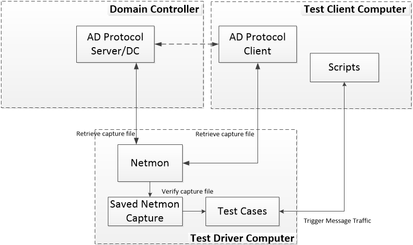
Figure 2-2:  Test Suite Architecture

The test suite architecture is comprised of a test driver computer, a test client computer, and a domain controller as described in the [Section 1.1](#_Introduction) of this document. 

* The test driver computer initializes the testing environment and does all the preparations.
* The test driver computer remotes to the client computer and triggers the scenario-specific scripts, which in turn trigger message traffic.
* The test driver computer verifies the status of both the client computer and DC.
* The test suite on test driver computer retrieves the capture file and verifies messages using the expected frames.
* Finally, the test suite does cleans up.

### <a name="_Toc427329432"/>Technical Feasibility of Message Generation/Adapter Approach
Message generation: 

* PowerShell scripts are used to trigger the message traffic and generate the capture files.

Message Validation:

* The Netmon API managed wrapper will be used to capture frames programmatically and is also used to validate the required frames from the saved capture files from the test suite.

### <a name="_Toc427329433"/>Considerations
Some test cases can be only triggered under specific testing environments. For example, the “Join a domain by creating an account via SAMR” test case cannot be triggered with a DC running on Windows Server 2008 R2 or later. So, running this scenario requires Window Server 2003 or earlier, or requires replacing the client with a Samba client.

### <a name="_Toc427329434"/>Test Scenarios

#### <a name="_Toc427329435"/>Test Scenarios

* Locate Domain Controller using DNS

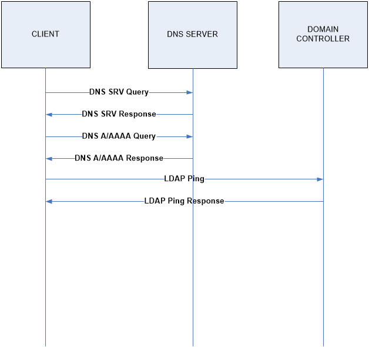

* Locate Domain Controller using NetBIOS

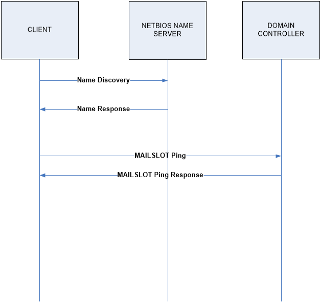

* Joining a Computer to a Domain by Creating an Account using LDAP

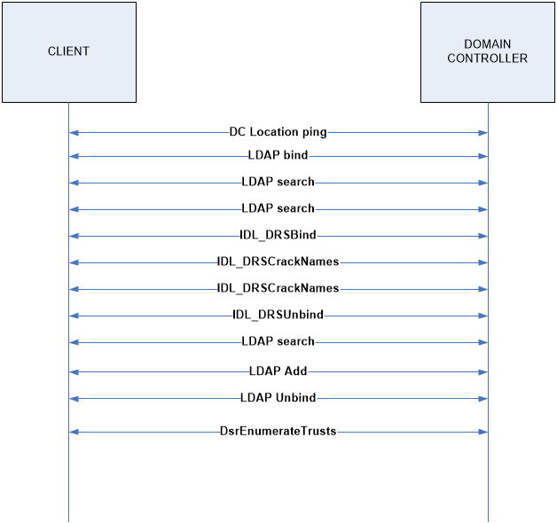

* Joining a Computer to a Domain with a new created account using SAMR

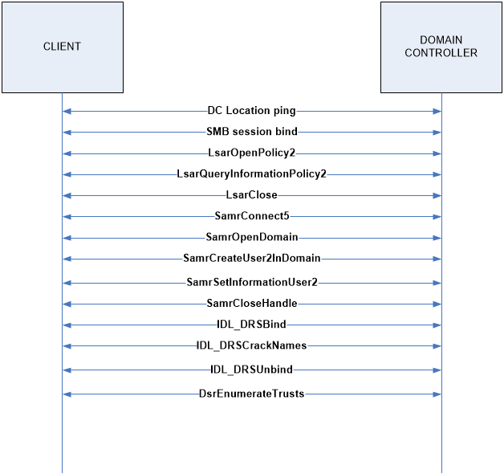

* Joining a Computer to a Domain with a predefined account (Not in MS-ADOD)

* Unjoin computer from a Domain

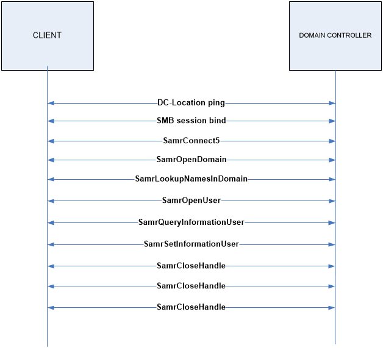

* Provision a User Account Using the LDAP Protocol

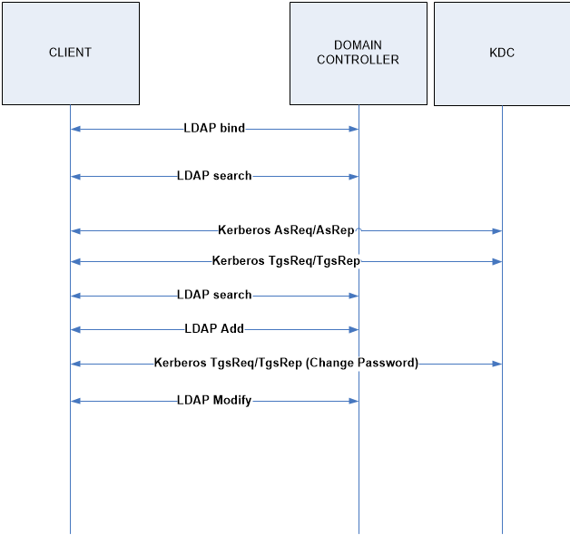

* Provision a User Account Using the SAMR Protocol

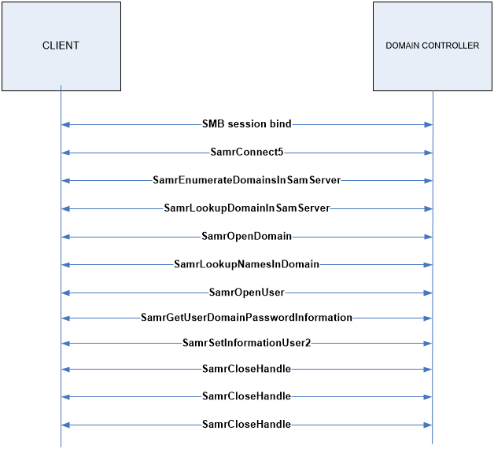

* Change the User Account Password Using the LDAP Protocol

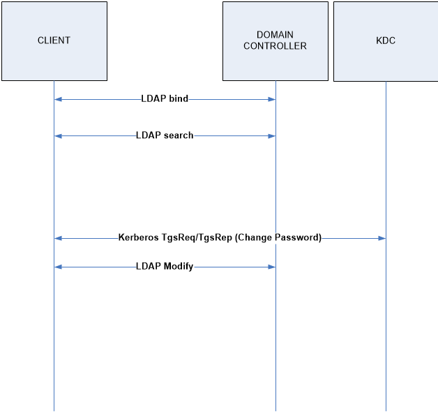

* Change the User Account Password Using the SAMR Protocol

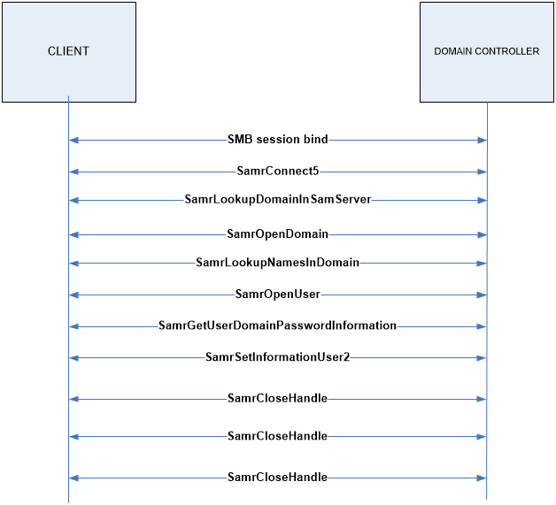

* Determine the Group Membership of a User Account Using the LDAP Protocol

* Delete a User Account

* Obtain a List of User Accounts Using the LDAP Protocol

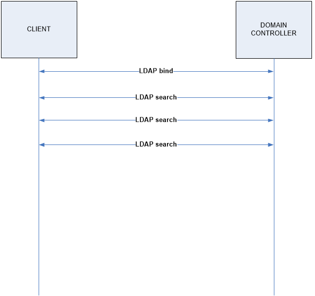

* Manage Groups and Their Memberships

* Delete a Group

#### <a name="_Toc427329436"/>Test Case Families

| Use case category| Use cases| 
| -------------| ------------- |
| Object Management| Create Directory Object in Application NC – Client Application| 
| | Search for Directory Object – Client Application| 
| | Modify Directory Object – Client Application| 
| | Delete Directory Object – Client Application| 
| | Create Organizational Unit – Client Application| 
| Identity Lifecycle Management| Create a New Account – Client Application| 
| | Reset an Existing Account's Password – Client Application| 
| | Change an Existing Account's Password – Client Application| 
| | Query an Account's Group Membership – Client Application| 
| | Delete an Account – Client Application| 
| | Create a Security Group – Client Application| 
| | Update Group Member List – Client Application| 
| | Query Members of a Group – Client Application| 
| Schema Management| Add a New Class to the Schema - Client Application| 
| | Add a New Attribute to the Schema - Client Application| 
| | Add an Attribute to a Class - Client Application| 
| Name Translation| Convert a SID to/from a Human-Readable Format – Client Application| 
| Directory Replication| Replicate Changes within a Domain – Domain Controller| 
| Domain Services| Join a Domain with a Pre-defined Account -Domain Client| 
| | Join a Domain with a New Account – Domain Client| 
| | Unjoin from a Domain – Domain Client| 
| | Locate a Domain Controller – Domain Client| 

## <a name="_Toc427329437"/>Test Suite Design

### <a name="_Toc427329438"/>Test Design Description
This section describes the MS-ADOD Scenarios test suite design. The Traditional test approach is followed for test suite development to test the overview document (OD) requirements with respect to MS-ADOD scenarios.

Adaptors:
* PowerShell adapters to manage Windows clients.
* Managed adapters to manage Linux Samba clients.
* Interactive adapters to manage unknown clients.

Network Monitor tools: 
* Use Network Monitor to capture messages over the wire.
* Use the Network Monitor PTF wrapper to validate captured messages.

### <a name="_Toc427329439"/>Test Cases Design

| Locate Domain Controller using DNS| |
| -------------| ------------- | 
|  **Test ID**| LocateDomainControllerDNS| 
|  **Priority**| p0| 
|  **Description** | Locate the Domain Controller using DNS| 
|  **Prerequisites**| DNS infrastructure availability| 
|  **Test Execution Steps**| Execute “Locate Domain Controller Adapter” and get the result.| 
| | Verify if the expected domain controller’s fully-qualified domain name (FQDN) is included in the result.| 
| | Verify the capture file using the expected message sequence.| 
|  **Requirements covered**|  | 
|  **Cleanup**| N/A| 

| Locate Domain Controller using Netbios| | 
| -------------| ------------- |
|  **Test ID**| LocateDomainControllerNetbios| 
|  **Priority**| p0| 
|  **Description** | Locate the Domain Controller using NetBIOS| 
|  **Prerequisites**| NetBIOS infrastructure availability| 
|  **Test Execution Steps**| Execute “Locate Domain Controller Adapter” and get the result.| 
| | Verify if the expected domain controller’s NetBIOS computer Name is included in this result| 
| | Verify the capture file using the expected message sequence.| 
|  **Requirements covered**|  | 
|  **Cleanup**| N/A| 

| Join Domain by Creating an Account using LDAP| | 
| -------------| ------------- |
|  **Test ID**| JoinDomainCreateAcctLDAP| 
|  **Priority**| p0| 
|  **Description** | Join Domain by Creating an Account using the LDAP Protocol| 
|  **Prerequisites**| The credentials of a domain administrator, who can create machine accounts in the domain, are available to the client administrator| 
|  **Test Execution Steps**| Execute “Join Domain by Creating an Account Adapter”| 
| | Verify that the client is domain joined, and that the joined domain name is correct.| 
| | Verify that the DC has an enabled account for the client computer.| 
| | Verify the capture file using the expected message sequence.| 
|  **Requirements covered**|  | 
|  **Cleanup**| Execute “Unjoin Domain Adapter”| 
| | Verify that the client is domain unjoined.| 
| | Delete the computer account from Active Directory| 

| Join Domain by Creating an Account using SAMR| | 
| -------------| ------------- |
|  **Test ID**| JoinDomainCreateAcctSAMR| 
|  **Priority**| p1| 
|  **Description** | Join Domain by Creating an Account using the SAMR Protocol| 
|  **Prerequisites**| The credentials of a domain administrator who can create machine accounts in the domain are available to the client administrator.| 
|  **Test Execution Steps**| Execute “Join Domain by Creating an Account Adapter”| 
| | Verify that client is domain joined, and that the joined domain’s name is correct| 
| | Verify that the DC has an enabled account for the client computer.| 
| | Verify the capture file using expected message sequence| 
|  **Requirements covered**|  | 
|  **Cleanup**| Execute “Unjoin Domain Adapter”.| 
| | Verify that client is domain unjoined.| 
| | Delete the computer account from Active Directory.| 

| Join Domain by a Predefined Account| | 
| -------------| ------------- |
|  **Test ID**| JoinDomainPredefAcct| 
|  **Priority**| p0| 
|  **Description** | Join Domain by a Predefined Account| 
|  **Prerequisites**| Create an account in active airectory;| 
| | The credentials of a domain administrator who can modify machine accounts in the domain are available to the client administrator;| 
|  **Test Execution Steps**| Execute “Join Domain by a Predefined Account Adapter”| 
| | Verify that the client status is domain joined and that the domain name is correct.| 
| | Verify that client’s computer account has been created and enabled| 
| | Verify capture file using the expected message sequence| 
|  **Requirements covered**|  | 
|  **Cleanup**| Execute “Unjoin Domain Adapter”| 
| | Verify that the client status is domain unjoined.| 
| | Delete the computer account from Active Directory| 

| Unjoin Domain| | 
| -------------| ------------- |
|  **Test ID**| Unjoin Domain| 
|  **Priority**| p0| 
|  **Description** | Unjoin Domain| 
|  **Prerequisites**| Client computer already joined domain;| 
| | The credentials of the domain administrator who can modify machine accounts in the domain are available to the client administrator;| 
|  **Test Execution Steps**| Execute “Unjoin Domain Adapter”| 
| | Verify that client status is domain unjoined.| 
| | Verify that DC has a disabled account for the client computer.| 
| | Verify capture file using the expected message sequence| 
|  **Requirements covered**|  | 
|  **Cleanup**| Delete the computer account from Active Directory| 

| Provision a User Account Using the LDAP Protocol| | 
| -------------| ------------- |
|  **Test ID**| ProvisionUserAcctLDAP| 
|  **Priority**| p0| 
|  **Description** | Provision a user account using the LDAP Protocol| 
|  **Prerequisites**| The client application has access to a directory server to which it can establish a connection (if it is not already connected) and send the request;| 
| | An object class exists in the Active Directory system schema that corresponds to the directory object to be created under the application NC;| 
| | The Active Directory system must host an application NC on which the Client Application is configured to store its application data;| 
| | The credentials of the domain administrator who can add and modify user accounts in the domain are available to the client administrator;| 
|  **Test Execution Steps**| Execute “Provision User Account Using LDAP Adapter”| 
| | Verify that the user has been created in AD| 
| | Authenticate the new created user| 
| | Verify the capture file using the expected message sequence| 
|  **Requirements covered**|  | 
|  **Cleanup**| Delete the user account in Active Directory| 

| Provision a User Account Using the SAMR Protocol| | 
| -------------| ------------- |
|  **Test ID**| ProvisionUserAcctSAMR| 
|  **Priority**| p1| 
|  **Description** | Provision a user account using the SAMR Protocol| 
|  **Prerequisites**| The client application has access to a directory server to which it can establish a connection (if it is not already connected) and send the request;| 
| | An object class exists in the Active Directory system schema that corresponds to the directory object to be created under the application NC;| 
| | The Active Directory system hosts an application NC on which the client application is configured to store its application data;| 
| | The credentials of the domain administrator who can add and modify user accounts in the domain are available to the client administrator;| 
|  **Test Execution Steps**| Execute “Provision User Account Using SAMR Adapter”.| 
| | Verify that the user has been created in AD.| 
| | Authenticate the new created user.| 
| | Verify the capture file using the expected message sequence.| 
|  **Requirements covered**|  | 
|  **Cleanup**| Delete the user account from Active Directory| 

| Change a User Account's Password using LDAP Protocol| | 
| -------------| ------------- |
|  **Test ID**| ChangeUserAcctPasswordLDAP| 
|  **Priority**| p0| 
|  **Description** | Change a user account’s password using LDAP protocol| 
|  **Prerequisites**| The client application has access to a directory server to which it can establish a connection (if it is not already connected) and send the request;| 
| | An object class exists in the Active Directory system schema that corresponds to the directory object to be created under the application NC;| 
| | The Active Directory system hosts an application NC on which the client application is configured to store its application data;| 
| | Create a new user account in AD;| 
| | The credentials of an administrator of the domain who can modify user accounts in the domain are available to the client administrator;| 
|  **Test Execution Steps**| Execute “Change User Account Password using LDAP Adapter”| 
| | Verify the DC status after triggering| 
| | Authenticate the user with new password| 
| | Verify the capture file using the expected message sequence| 
|  **Requirements covered**|  | 
|  **Cleanup**| Delete the user account in Active Directory| 

| Change a User Account's Password using SAMR Protocol| | 
| -------------| ------------- |
|  **Test ID**| ChangeUserAcctPasswordSAMR| 
|  **Priority**| p1| 
|  **Description** | Change a user account’s password using SAMR protocol| 
|  **Prerequisites**| The client application has access to a directory server to which it can establish a connection (if it is not already connected) and send the request;| 
| | An object class exists in the Active Directory system schema that corresponds to the directory object to be created under the application NC;| 
| | The Active Directory system hosts an application NC on which the Client Application is configured to store its application data;| 
| | Create a new user account in AD;| 
| | The credentials of a domain administrator who can modify user accounts in the domain are available to the client administrator;| 
|  **Test Execution Steps**| Execute “Change User Account Password using SAMR Adapter”| 
| | Verify the DC status after triggering| 
| | Authenticate the user with new password| 
| | Verify the capture file using the expected message sequence| 
|  **Requirements covered**|  | 
|  **Cleanup**| Delete the user account in Active Directory| 

| Determine the Group Membership of a User Account using LDAP| | 
| -------------| ------------- |
|  **Test ID**| DetermineGroupMembershipofUserAcctLDAP| 
|  **Priority**| p0| 
|  **Description** | Determine the group memberships of a user account using the LDAP Protocol| 
|  **Prerequisites**| The client application has access to a directory server to which it can establish a connection (if it is not already connected) and send the request;| 
| | Create a new user account in AD;| 
| | Create a new group in AD;| 
| | Add that new user to the group;| 
|  **Test Execution Steps**| Execute “Determine Group Membership of User Account Using LDAP Adapter”| 
| | Get the result which represents the group memberships of the new created user account| 
| | Verify that the new group name is included in the test result| 
| | Verify the capture file using the expected message sequence| 
|  **Requirements covered**|  | 
|  **Cleanup**| Delete the user account in Active Directory| 
| | Delete the group in Active Directory| 

| Delete a User Account| | 
| -------------| ------------- |
|  **Test ID**| DeleteUserAcct| 
|  **Priority**| p0| 
|  **Description** | Delete a user account| 
|  **Prerequisites**| The client application has access to a directory server to which it can establish a connection (if it is not already connected) and send the request;| 
| | The directory object to be deleted must exist in the Active Directory system;| 
| | Create a new user account in AD;| 
|  **Test Execution Steps**| Execute “Delete User Account Adapter”| 
| | Verify that the new created account is deleted from AD| 
| | Verify the capture file using the expected message sequence| 
|  **Requirements covered**|  | 
|  **Cleanup**| N/A| 

| Obtain a List of User Accounts Using the LDAP Protocols| | 
| -------------| ------------- |
|  **Test ID**| ObtainListofUserAcctLDAP| 
|  **Priority**| p1| 
|  **Description** | Obtain a list of user accounts using the LDAP Protocol| 
|  **Prerequisites**| The client application has access to a directory server to which it can establish a connection (if it is not already connected) and send the request;| 
| | Create a new user account in AD;| 
|  **Test Execution Steps**| Execute “Obtain User Accounts using LDAP Adapter”| 
| | Verify that the new created user account exists| 
| | Verify the capture file using the expected message sequence| 
|  **Requirements covered**|  | 
|  **Cleanup**| Delete the user account from Active Directory| 

| Manage Groups and Their Memberships| | 
| -------------| ------------- |
|  **Test ID**| ManageGroupsandTheirMemberships| 
|  **Priority**| p0| 
|  **Description** | Manage Groups and Their Memberships| 
|  **Prerequisites**| The Client Application has access to a directory server to which it can establish a connection (if it is not already connected) and send the request;| 
| | The credentials of the domain administrator who can add and modify user and group accounts in the domain are available to the client administrator; | 
|  **Test Execution Steps**| Execute “Manage Groups and Their Member Adapter”| 
| | Verify that the new created user account exists in the new created group’s user member list| 
| | Verify the capture file using the expected message sequence| 
|  **Requirements covered**|  | 
|  **Cleanup**| Delete the user account from Active Directory| 
| | Delete the group from Active Directory| 

| Delete a Group| | 
| -------------| ------------- |
|  **Test ID**| DeleteGroup| 
|  **Priority**| p0| 
|  **Description** | Delete a group| 
|  **Prerequisites**| The client application has access to a directory server to which it can establish a connection (if it is not already connected) and send the request;| 
| | The directory object to be deleted exists in the Active Directory system;| 
| | create a new group in AD;| 
|  **Test Execution Steps**| Execute “Delete Group Adapter”| 
| | Verify that the new created group has been successfully deleted from AD| 
| | Verify the capture file using the expected message sequence| 
|  **Requirements covered**|  | 
|  **Cleanup**| N/A| 

### <a name="_Toc427329440"/>Adaptors
N/A

## <a name="_Toc427329441"/>Appendix

### <a name="_Toc427329442"/>Glossary (Optional)
N/A

### <a name="_Toc427329443"/>Reference

* Technical document MS-ADOD

